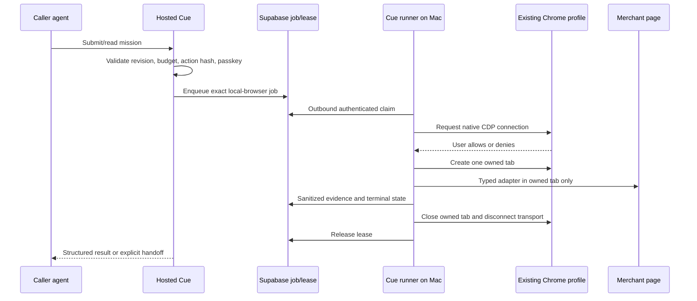

# Local Chrome runner architecture

Status: architecture plus a consent-only CLI bridge. No Chrome setting was changed, no debugging connection was requested, and no browser profile or page content was inspected while building it. Merchant navigation and worker integration remain unimplemented.

## Consent-only CLI

The preparatory bridge is [scripts/local-browser.ts](../scripts/local-browser.ts). Run it with Node 24 from the canonical repository:

```sh
node --import tsx scripts/local-browser.ts status
node --import tsx scripts/local-browser.ts probe --confirm-profile-access
```

`status` reads only Chrome Stable's `DevToolsActivePort` readiness marker. It does not connect. If remote debugging is disabled, it gives the exact `chrome://inspect/#remote-debugging` instruction without printing the profile path, port, or WebSocket URL.

`probe` requires the explicit CLI acknowledgment and Chrome's separate native Allow action. It holds a private local lease, attaches with `isLocal: true` and `noDefaults: true`, creates one `about:blank` page, verifies that exact page through its target session, closes it, disconnects the Playwright transport, and releases the lease. Attach has a 20-second timeout; the post-connect lifecycle has a 25-second deadline, followed by bounded page and transport cleanup. Signals and lifecycle expiry force transport disconnection, and lease release runs after those bounded cleanup attempts. Stale leases fail closed because safely replacing a lock requires compare-and-swap storage; the CLI tells the user to verify that no runner is active before manually removing one.

The application does not enumerate or explicitly access existing pages, navigate, evaluate page content, take screenshots, or read/export cookies and storage. Playwright's CDP attach initializes representations of pre-existing targets internally, so the CLI does not claim that the SDK itself is blind to them. Output is fixed structured status without raw errors or connection details.

This command has been typechecked and its help/consent-denied paths have been exercised. The approved scope explicitly excluded enabling Chrome or attaching during implementation, so the native connection path remains unexecuted and must not be presented as working proof.

## Decision

Cue can reuse a person's existing signed-in Chrome profile through a **trusted local runner on that Mac**. The hosted Cue service must not expose Chrome DevTools MCP tools to the caller or model. It should send a narrow, server-authorized job to the local runner; the runner opens one new owned tab in the existing profile, executes only Cue's typed browser adapter, returns sanitized evidence, closes that tab, and releases its lease.

This preserves Cue's current authorization boundary:

1. The hosted server validates the workspace, task revision, budget, proposal, action hash, and native-passkey approval.
2. A registered local runner claims the exact job once.
3. Chrome separately asks the user to allow the local debugging connection.
4. The runner executes only the approved adapter in one owned tab.
5. Provider confirmation, ambiguity, or handoff is persisted through the same compare-and-swap mission path.

Local browser access does not replace passkey approval, budget reservation, idempotency, or provider confirmation.

## Verified platform behavior

Chrome 144 and later support permission-based auto-connect to a running Chrome instance. The user must first enable remote debugging at `chrome://inspect/#remote-debugging`. When a client requests a session, Chrome displays an Allow/deny dialog. Auto-connect inherits the selected profile's current tabs, extensions, cookies, session storage, local storage, and authenticated application state. Chrome's documentation warns that the agent can access all data in that profile. The local Chrome DevTools server does not send browser data or session tokens to Google, but any controlling application can read data made available by CDP. See [Chrome's auto-connect guide](https://developer.chrome.com/docs/devtools/agents/use-cases/auto-connect) and [Chrome DevTools MCP advanced usage](https://github.com/ChromeDevTools/chrome-devtools-mcp/blob/main/docs/advanced-usage.md#connecting-to-a-running-chrome-instance).

The current Chrome DevTools MCP implementation uses Puppeteer 25.12.0. With `--autoConnect`, it calls `puppeteer.connect` with the selected Chrome channel. Puppeteer's documented `channel` connection looks for the active WebSocket in that channel's normal user-data directory and connects to `ws://localhost:$ActivePort/devtools/browser`. If an explicit user-data directory is supplied, Chrome DevTools MCP reads its `DevToolsActivePort`, validates the port and browser path, and constructs the loopback WebSocket endpoint. See [BrowserManager source](https://github.com/ChromeDevTools/chrome-devtools-mcp/blob/main/src/BrowserManager.ts#L330-L418), [browser option source](https://github.com/ChromeDevTools/chrome-devtools-mcp/blob/main/src/config/browser-options.ts), and [Puppeteer ConnectOptions](https://pptr.dev/api/puppeteer.connectoptions).

Playwright's public `chromium.connectOverCDP(endpointURL)` accepts either that CDP WebSocket URL or the loopback HTTP endpoint. It exposes the existing default browser context. Playwright calls this connection lower fidelity than its own protocol and warns that some features can break when Chrome was not launched with Playwright's expected arguments. Version 1.60 added `noDefaults`; for a daily-driver browser it avoids changing download, focus, and media defaults in the attached default context. Cue already has `playwright-core` 1.63, so the proposed attach shape is supported. See [Playwright BrowserType.connectOverCDP](https://playwright.dev/docs/api/class-browsertype#browser-type-connect-over-cdp).

The official Eve registry has no native existing-profile Chrome connection. `eve registry search chrome --json` returned Chrome DevTools skills, while `eve registry search browser --json` returned managed/isolated browser connections such as Browser Use, Browserbase, agent-browser, and Kernel. Those do not satisfy this request to reuse the person's existing Chrome profile. Eve connections can broker MCP tools and apply per-connection approval, but exposing the full Chrome MCP surface would still give the agent tools that can enumerate and control the profile. Eve's installed connection documentation also says localhost no-auth connections are only appropriate when protected outside Eve and that sensitive connection tools need approvals or allowlists.

## Minimal architecture



### Local runner

Run a signed Cue helper as the logged-in macOS user. It should be a small Node 24 process using the existing Playwright dependency, not a general MCP server. Store its device credential in macOS Keychain. Its network behavior is outbound only: long-poll an authenticated Cue endpoint or subscribe to a scoped Supabase queue, claim one job atomically, and post results back. Do not expose a listening browser-control port to the LAN or public Internet.

The cloud service cannot call `localhost` on the user's Mac. A hosted Eve MCP connection to a local Chrome process therefore cannot work without a tunnel, relay, or outbound runner. A public tunnel would broaden the attack surface and is unnecessary for this design.

### Chrome attach

The consent flow should be explicit and user-driven:

1. The UI explains that local mode can access the selected Chrome profile, including all open windows and authenticated storage.
2. The user starts Chrome 144+ and manually enables remote debugging at `chrome://inspect/#remote-debugging`.
3. The local runner requests a connection only while an authorized job is waiting.
4. Chrome presents its native connection prompt; denial becomes `waiting_for_chrome_permission`, never an automatic retry loop.
5. After permission, the runner discovers the loopback CDP endpoint from the channel's `DevToolsActivePort` and calls `chromium.connectOverCDP(endpoint, {isLocal: true, noDefaults: true})`.

Step 5 is a feasible composition of Chrome's documented endpoint discovery and Playwright's documented CDP attach API. Chrome and Playwright do not publish a single end-to-end example of this exact combination, so implementation should begin with a consent-only compatibility test on an empty owned tab. Do not fall back to launching Chrome with a fixed `--remote-debugging-port` against the default profile. Chrome's manual-port guidance requires a non-default user-data directory and warns that any local application can control an exposed debugging port.

### One-tab ownership

Connecting grants profile-wide CDP visibility, so Cue must narrow its own behavior:

- Acquire the existing durable `(workspace, lane)` lease plus a local device lease before requesting Chrome permission.
- Create a new blank tab after connecting. Never select or reuse a pre-existing user tab unless a future UI explicitly names that tab and grants separate consent.
- Generate a random job tab ID in runner memory and bind the Playwright `Page`, CDP target ID, workspace, task, proposal revision, and action hash to the lease.
- Do not call page-list, cookie, local-storage export, history, password, extension, or profile-management APIs. Login reuse occurs naturally when the owned tab navigates in the existing default context.
- Reject any action if the owned page or target ID is lost, replaced, detached, or no longer matches the lease.
- Close only the owned page. Never send CDP `Browser.close` or terminate the daily-driver Chrome process. For a Playwright `connectOverCDP` attachment, `browser.close()` invokes its injected transport-close callback, so use it only after closing the owned page to disconnect that client transport.
- Return titles, prices, state labels, provider references, and approved evidence fields only. Do not return cookies, storage, headers, raw network bodies, Chrome profile paths, CDP URLs, or unrelated tab metadata.

### Page-scoped guardrails

The current food guard uses `browserContext.route`, which would affect unrelated user tabs in a shared profile. Local mode must not install context-wide routing, service-worker, permission, viewport, download, geolocation, or emulation changes.

For the owned page only:

- Open a CDP session attached to that page target.
- Set service-worker bypass on that page session before navigation, then enable CDP `Fetch` interception for that target and its frames.
- Continue `GET`, `HEAD`, and `OPTIONS` only to the exact adapter allowlist.
- Permit a write request only when the immutable approved action includes an exact reviewed method, origin, pathname, operation name, and request-body hash/schema. All unknown writes fail closed.
- Reject cross-origin main-frame navigation outside the task allowlist.
- Treat popups as new unowned targets: close them unless the adapter explicitly claims one under the same lease and policy.
- Disable downloads for the owned page, reject file chooser access, and never grant new browser permissions.
- Capture request metadata only when required for verification. Redact query strings, authorization headers, bodies, addresses, and session identifiers from reports.

`page.route` is useful for ordinary requests, but service-worker behavior and shared-context risk make a page-attached CDP `Fetch` policy the stronger primary guard. This design still needs a local compatibility test because CDP interception behavior for existing service workers and child targets is site-dependent.

## Product states and consent

Suggested states are `waiting_for_local_runner`, `waiting_for_chrome_permission`, `local_tab_open`, `prepared`, `awaiting_approval`, `executing`, `confirmed`, `needs_human`, and `cleanup_unconfirmed`.

The UI should show:

- device name and last-seen time;
- the exact merchant host and requested action;
- whether the job is read-only, preparatory, or approved for one write;
- the owned-tab indicator and a Stop button;
- a reminder that native Chrome permission grants profile-wide technical access even though Cue's runner policy uses one tab;
- cleanup outcome and the exact remaining human step.

Chrome's native Allow dialog authorizes the debugging connection. It does not authorize a purchase, message, registration, or budget change. Cue's passkey approval remains the only commitment authorization.

## Security boundaries

Supported in the proposed design:

- reuse of current first-party login cookies without exporting them;
- one local Mac runner, one workspace, one manager, and one owned tab per lane lease;
- hosted deterministic budget, revision, reservation, idempotency, and passkey checks;
- exact adapter allowlists and sanitized evidence;
- explicit Chrome connection permission and visible local stop/cleanup.

Not supported by this spike:

- unrestricted Chrome MCP tools for caller agents;
- remote cloud access to localhost;
- arbitrary browsing or arbitrary JavaScript evaluation;
- controlling existing user tabs by default;
- cookie, password, history, storage, or extension export;
- team RBAC, shared household profiles, unattended background purchasing, or several managers sharing one profile;
- a claim that Playwright attachment has been live-tested with Chrome's permission flow.

## Implementation sequence

1. Build a consent-only local runner prototype that attaches, opens `about:blank`, records its own target ID, closes that tab, and disconnects. Use a disposable non-sensitive Chrome state for the first test even though the product goal is the existing profile.
2. Add device registration and outbound authenticated job claiming. Bind claims to workspace, device, lane, task, proposal revision, expiry, and action hash.
3. Port one read-only adapter with page-scoped CDP `Fetch` interception. Verify unrelated user-tab traffic is unaffected.
4. Add sanitized evidence upload and cleanup reconciliation. Kill the helper during each lifecycle phase to test lease expiry and tab cleanup.
5. Add preparatory form fills with DOM selected-state readback. Keep final commitment writes disabled.
6. Enable one exact approved write only after the local read-only/preparatory path, passkey binding, request schema, idempotency, and provider confirmation all pass independent review.

## Go/no-go criteria

Proceed if Chrome's native prompt reliably gates every new local connection, Playwright 1.63 can attach without changing unrelated tabs, the owned-page CDP policy sees service-worker and frame requests, browser disconnect leaves daily-driver Chrome running, and forced failures release or quarantine the exact lease.

Stop and retain Surfsky handoff if connection permission cannot be scoped and explained, unrelated tabs are modified, request interception misses a provider write path, cleanup cannot identify the owned tab, or the local runner would require exposing a debugging endpoint beyond loopback.
